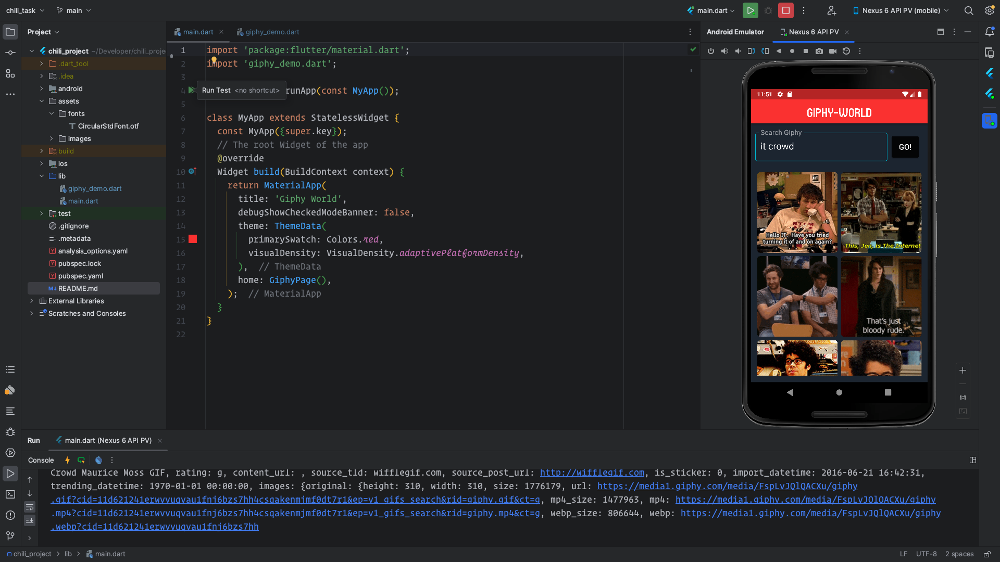

## chili-labs_task: 📲
    Create an application to search for GIF images
    using Giphy API (https://developers.giphy.com/docs/api/endpoint#search).
Requirements: ❓ ℹ️

- [ ] `Implement "live search"` - i.e. request is sent in
 N milliseconds (for example 300) after
 the user has entered some input;

- [x] `Results` are displayed in the `list or grid` of items;

- [ ] `Request pagination` - load enough items to populate the
 list and load more items every time the user scrolls to the
 end of the list (limit/offset);
    
    `UI can be very simple but should be responsive`,
 snappy, and implemented according to the platform guidelines;

 ### bonus 🌶 :
- [ ] Loading more results "seamlessly" before the user reaches the last
     item in the list so (at least on a decent network connection) the
     scrolling is not interrupted by the next page load;
- [ ] Using state management approaches or libraries such as BLoC
     (flutter_bloc), Riverpod or others;
- [ ] Separating business logic from the UI;
- [ ] Unit tests (we don't expect 100% coverage but rather
     see how do you approach unit testing)

#### notes:
    // references and helpers : https://docs.flutter.dev/ui,
    // app-icon: https://icons8.com/icon/12513/google-web-search
    // tutorial_help : https://www.youtube.com/watch?v=akMH3UOvYu8
    // (as it was my first Flutter App i used tutorial)

    
